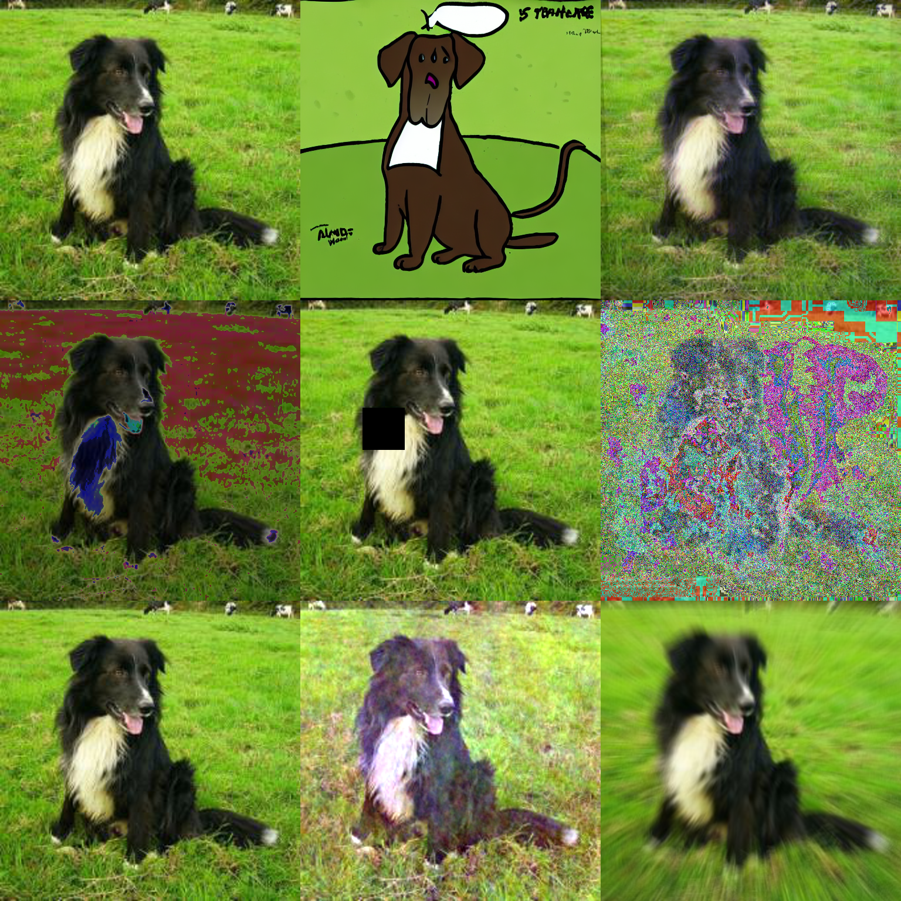

# NotJustPrettyPictures
## Not Just Pretty Pictures: Text-to-Image Generators Enable Interpretable Interventions for Robust Representations:

#### Demo for Visualisation of Different Data Augmentation techniques: 
Google colab: https://drive.google.com/file/d/17595l3D_882SZUzxONYpigY_EwGwjfMe/view?usp=sharing
##### Example:


#### Usage:

  1. Environments:

     1. install requirements.yaml

     2. ```
        cd ./generative_model
        git clone 'https://github.com/openai/CLIP'
        git clone 'https://github.com/CompVis/taming-transformers'
        ```

        

  2. Download Dataset

     Please download the PACS dataset from http://www.eecs.qmul.ac.uk/~dl307/project_iccv2017. Then update metadata in the following format (see data/data_lists):

     ```
     /home/user/data/images/PACS/kfold/art_painting/dog/pic_001.jpg 0
     /home/user/data/images/PACS/kfold/art_painting/dog/pic_002.jpg 0
     /home/user/data/images/PACS/kfold/art_painting/dog/pic_003.jpg 0
     ...
     ```

     Please update the input_dir to the metadata directory in shell_pacs_intervention.py and shell_single_train.py

     

3. Pre-generate intervention data.

   To generate data locally, please set up Huggingface stable diffusion following this link: (https://huggingface.co/spaces/stabilityai/stable-diffusion)

   Please specify the output_dir in shell_pacs_intervention.py and run: 

   ```
   bash intervene.sh
   ```


4. Run Training:

   ```
   python ./create_algo_folders.py
   nohup bash ./shell/train_all_PACS.sh > E30_STEP_PRET_PACS_CEONLY_P1.out 2>&1 &
   ```

   

5.  Check result:

   ```
   python ./read_log/read_log.py
   ```


#### Acknowledgement
This repo is adapted from https://github.com/BIT-DA/CIRL. We thanks them for their excellent project!
